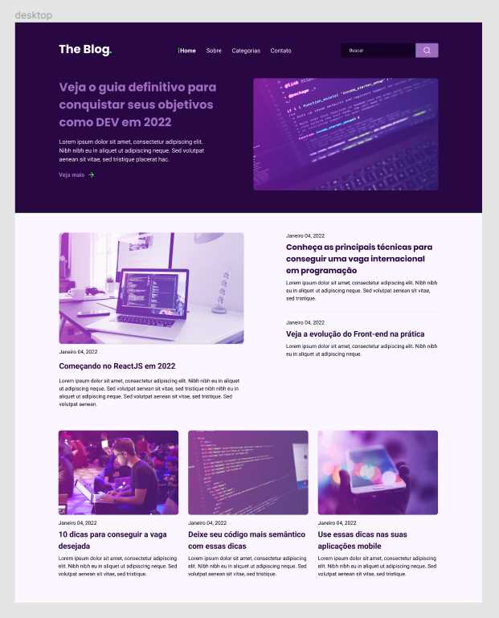

# frontend-rocketblog
<h2>Challenge frontend design for Project RocketBlog</h2>

<h2>Blog Page</h2>

<strong>Project:</strong> Convert blog from Figma. Using:

<ul>
  <li>HTML</li>
  <li>CSS</li>
  <li>Sass SCSS</li>
  <li>Javascript</li>
  <li>Media Queries</li>
  <li>Flexbox</li>
  <li>Grid</li>
  <li>Responsive</li>
</ul>

...

<strong>Notes:</strong>The task was just converting figma layout to deskop code, but I decided to also add some responsivity within the grid and flexbox CSS as well.

<h2>Example Images</h2>

Figma Reference 

Desktop Layout 

